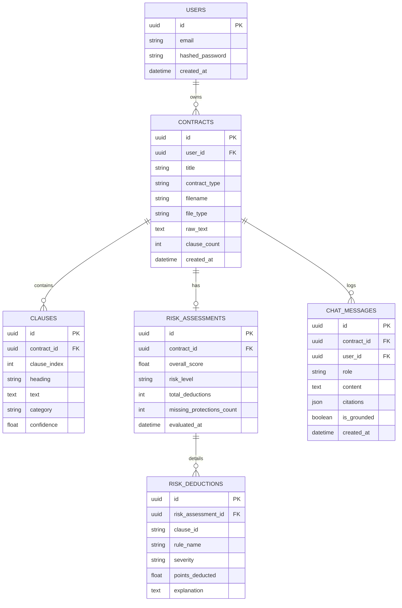

# LegalLens System Architecture 🏛️

## 1. System Overview
LegalLens is an AI-powered contract intelligence platform built as an academic MCA mini project. It provides explainable, first-pass automated contract review and grounded question-answering for everyday agreements (freelance, employment, rental, and vendor contracts).

The system enforces strict scope discipline per `AGENTS.md`: avoiding Docker/Kubernetes or microservices, relying on native Python and FastAPI concurrency, and strictly maintaining per-user account data isolation.

---

## 2. Core Pipelines & Component Diagram

```mermaid
graph TD
    subgraph Client Layer
        UI[React + Vite + Tailwind CSS Dashboard]
    end

    subgraph API Layer [FastAPI / Uvicorn]
        Auth[Auth / User Context Resolver]
        RouterContracts[Contracts & Upload Router]
        RouterRisk[Risk Assessment Router]
        RouterQA[Grounded QA Router]
        RouterExport[ReportLab PDF Export Router]
    end

    subgraph Analysis Pipeline [Phase 1-4]
        Parser[Document Parser: PyMuPDF / python-docx]
        Segmenter[Clause Segmenter: RegEx & Layout Rules]
        Classifier[Clause Classifier: Fine-Tuned InLegalBERT]
        RiskEngine[Risk Engine: Imbalance Rules + Checklists]
    end

    subgraph RAG Pipeline [Phase 5]
        Embedder[Sentence-Transformers: all-MiniLM-L6-v2]
        VectorStore[(ChromaDB Persistent Store: User Scoped)]
        QAEngine[Grounded QA Engine: Citations & Refusal]
    end

    subgraph Data Store Layer [Phase 7]
        DB[(PostgreSQL / SQLite: SQLAlchemy 2.0 ORM)]
    end

    UI <-->|HTTP / REST API| API Layer
    RouterContracts --> Parser --> Segmenter --> Classifier --> RiskEngine
    Segmenter --> Embedder --> VectorStore
    RouterRisk --> DB
    RouterQA --> QAEngine
    QAEngine --> VectorStore
    RouterExport --> DB
    RiskEngine --> DB
```

---

## 3. Relational Data Model (PostgreSQL / SQLAlchemy)

Every entity is directly or indirectly scoped by `user_id`. Cascade deletions ensure no orphaned data remains upon document deletion.



---

## 4. Multi-Tenant User Isolation Architecture

### 4.1 Relational Queries
Every database query checks user authorization:
```python
stmt = select(Contract).where(Contract.id == contract_id, Contract.user_id == user_id)
```
Cascade delete constraints (`ondelete="CASCADE"`) guarantee that deleting a contract instantly purges all linked clauses, risk assessments, deductions, and chat history.

### 4.2 Vector Store Compound Filtering (ChromaDB)
In the persistent ChromaDB collection, every embedded clause is tagged with both `user_id` and `contract_id` metadata. All similarity searches require compound boolean filtering:
```python
results = collection.query(
    query_texts=[question],
    n_results=top_k,
    where={
        "$and": [
            {"user_id": str(user_id)},
            {"contract_id": str(contract_id)}
        ]
    }
)
```
This guarantees zero cross-user vector data leakage.

---

## 5. Explainable Risk Scoring Engine

LegalLens avoids opaque black-box scoring and avoids clause-level averages (which would dangerously dilute critical risks like unilateral termination across dozens of standard clauses). Instead, it uses a **transparent weighted deduction formula**:

$$\text{Overall Score} = 100 - \sum_{i \in \text{flagged}} \left( \text{Weight}_i \times \text{Confidence}_{\text{rule}, i} \times \text{Confidence}_{\text{classifier}, i} \right)$$

### Severity Weights:
- **High Risk**: 20 points (e.g. Unilateral termination without cause, uncapped indemnification)
- **Medium Risk**: 10 points (e.g. Indefinite non-compete, vague deliverables)
- **Low Risk**: 5 points (e.g. Missing standard protective checklist items)

### Score Bands:
- `80 – 100`: **Low Risk (Green)**
- `60 – 79`: **Moderate Risk (Yellow)**
- `0 – 59`: **High Risk (Red)**

Every single deduction includes an auditable explanation citing the specific clause ID and triggered rule.

---

## 6. Grounded RAG QA Engine with Anti-Hallucination Guardrails

1. **Top-$K$ Retrieval**: Extracts top-$K$ clauses by cosine similarity over embeddings.
2. **Relevance Threshold**: Rejects clauses with similarity scores below the noise threshold.
3. **Specific Subject Filter**: Explicitly detects queries asking about concepts absent from the contract text (e.g. "cryptocurrency", "pet policy", "parental leave").
4. **Guaranteed Refusal**: When no clauses are relevant, outputs the strict refusal:
   > *"The contract does not address this question based on the retrieved clauses."*
5. **Exact Grounding**: Every answered query includes source citations linking directly to the clause index (e.g., `[Clause 2]`).

---

## 7. Indian Legal Jurisdiction Transfer Findings

While InLegalBERT was pretrained on Indian court judgments, CUAD consists predominantly of US/UK commercial agreements. The Phase 8 evaluation harness benchmarked this jurisdictional transfer:
1. **High Direct Transfer**:
   - Arbitration clauses (mapped smoothly to the Arbitration and Conciliation Act 1996).
   - Governing law & jurisdiction selection.
   - Payment, default, and TDS/taxation structure.
2. **Key Jurisdictional Divergence**:
   - **Section 27 of the Indian Contract Act 1872**: In India, post-employment non-competes are **void ab initio**, unlike US common law where reasonable non-competes are enforceable. LegalLens flags this divergence in `eval/results/indian_transfer_findings.json`.

---

## 8. Compliance & Ethical Boundaries
- **Auditable Scorer**: No numeric score is displayed without explicit breakdown items.
- **Credential Protection**: All API keys and secrets loaded strictly from environment variables (`.env`).
- **Prominent Disclaimers**: Every screen, PDF report, and risk audit card displays a prominent notice:
  > *"LegalLens is an automated first-pass contract analysis tool. It does not provide legal advice and is never a substitute for a licensed attorney."*
